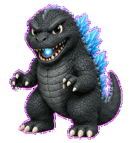
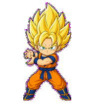

# My Codex Pet

這個 repository 收錄可直接安裝到 Codex Desktop 的 Q 版動畫寵物。兩個寵物皆採用 Codex Sprite v2 格式，包含完整的狀態動畫與方向注視圖格。

## 寵物一覽

### 哥吉拉

電影怪獸風格的 Q 版哥吉拉。Codex 執行任務時會從口中噴射藍色輻射能量。



### 超級賽亞人

以經典超級賽亞人造型為靈感的 Q 版戰士。受 Codex Sprite v2 固定的 idle 動畫節奏限制，寵物在待機與執行期間都會約每 6.6 秒蓄力並發射一次龜派氣功。



## 安裝指南

### 方法一：安裝全部寵物

在終端機執行：

```bash
git clone https://github.com/cmh3601/My-Codex-Pet.git
cd My-Codex-Pet

mkdir -p ~/.codex/pets
cp -R pets/godzilla ~/.codex/pets/godzilla
cp -R pets/super-saiyan ~/.codex/pets/super-saiyan
```

### 方法二：只安裝一隻寵物

只安裝哥吉拉：

```bash
mkdir -p ~/.codex/pets
cp -R pets/godzilla ~/.codex/pets/godzilla
```

只安裝超級賽亞人：

```bash
mkdir -p ~/.codex/pets
cp -R pets/super-saiyan ~/.codex/pets/super-saiyan
```

### 完成安裝

1. 完整關閉並重新啟動 Codex Desktop。
2. 開啟 Codex 的寵物選單。
3. 選擇「哥吉拉」或「超級賽亞人」。

若更新後仍顯示舊版動畫，請先刪除對應資料夾，再重新複製：

```bash
rm -rf ~/.codex/pets/godzilla
rm -rf ~/.codex/pets/super-saiyan

cp -R pets/godzilla ~/.codex/pets/godzilla
cp -R pets/super-saiyan ~/.codex/pets/super-saiyan
```

## 資料夾結構

```text
My-Codex-Pet/
├── pets/
│   ├── godzilla/
│   │   ├── pet.json
│   │   └── spritesheet.webp
│   └── super-saiyan/
│       ├── pet.json
│       └── spritesheet.webp
└── previews/
    ├── godzilla-running.gif
    └── super-saiyan-running.gif
```

每個可安裝寵物資料夾都包含：

- `pet.json`：寵物識別資訊與 Sprite 版本。
- `spritesheet.webp`：Codex 使用的動畫圖集。

## 移除寵物

```bash
rm -rf ~/.codex/pets/godzilla
rm -rf ~/.codex/pets/super-saiyan
```

移除後請重新啟動 Codex Desktop。

## Disclaimer

This is an unofficial fan-made project for personal customization. Character names, designs, and related trademarks belong to their respective owners. This repository is not affiliated with or endorsed by the original rights holders.
